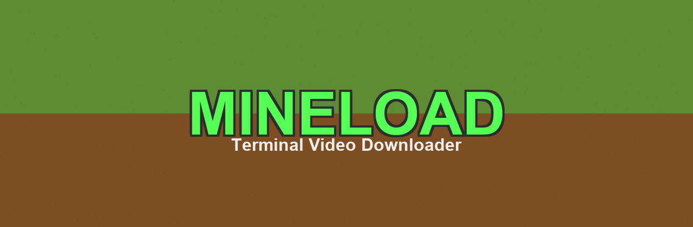
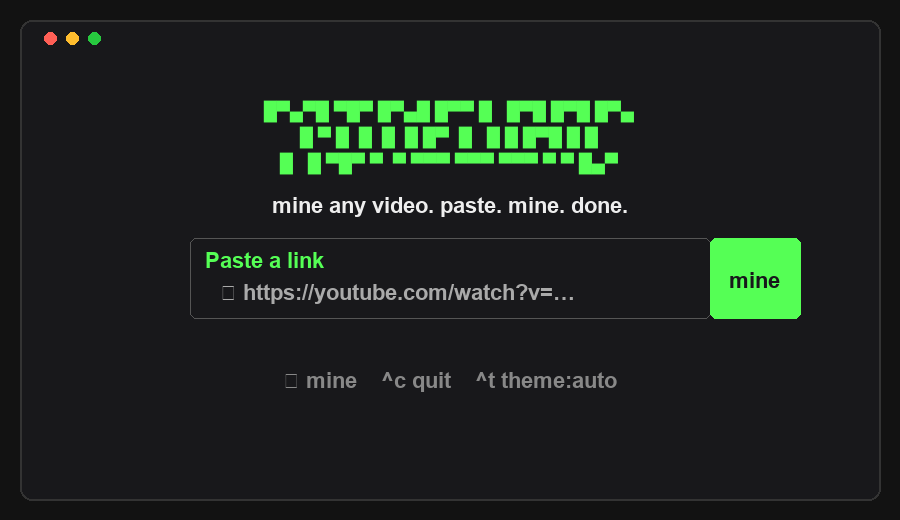

# mineload



<p align="center">
  <strong>Mine any video. Paste. Mine. Done.</strong>
</p>

<p align="center">
  A Minecraft-styled terminal video downloader for YouTube, X/Twitter, Instagram, Threads, TikTok and 1,800+ sites.
</p>

<p align="center">
  
</p>

## Features

- 🎮 Minecraft-inspired terminal UI with grass-green dark theme
- ⛏ One-command downloads: paste a URL, pick quality, hit **mine**
- 🎵 Video (mp4) or audio-only (mp3) formats
- 🖱️ Fully mouse-clickable — or use keyboard (↑/↓, Enter, Esc)
- 🌓 Auto, light, and dark themes
- 📦 No Python or manual dependency setup needed

## Requirements

- **Node.js 18+** — the only thing you need to install yourself
- **yt-dlp** — downloaded automatically on first run to `~/.mineload/bin`
- **ffmpeg** — optional, used for merging high-res streams and mp3 extraction. If not on your system, a bundled fallback (`ffmpeg-static`) is used when available.

> **Note:** On Windows, PowerShell may ask you to allow script execution the first time you run a globally installed CLI. If you see an execution-policy error, run:
> ```powershell
> Set-ExecutionPolicy -ExecutionPolicy RemoteSigned -Scope CurrentUser
> ```

## Install

### From npm (recommended)

```sh
npm install -g mineload
```

Try without installing:

```sh
npx mineload
```

### From GitHub

```sh
git clone https://github.com/callmeahmadnasir-ops/mineload.git
cd mineload
npm install
npm run build
npm link
```

Then run from anywhere:

```sh
mineload https://youtu.be/dQw4w9WgXcQ
```

## Usage

```sh
$ mineload https://youtu.be/dQw4w9WgXcQ    # straight to the format picker
$ mineload                                 # prompts for a url
$ mineload --theme dark                    # minecraft green palette
```

- Pick a format with `↑` / `↓` (or `j` / `k`, or number keys) and press **Enter**.
- Press **Esc** to go back, **Ctrl+C** to quit.
- Click the **mine** button, the format list, or the footer hints with your mouse.
- Click the logo to return home.
- Downloads are saved to `~/Downloads`.

Use `--theme auto`, `--theme light`, or `--theme dark` to set the starting theme.

## How it works

Powered by [yt-dlp](https://github.com/yt-dlp/yt-dlp). On first run, mineload downloads the standalone yt-dlp binary to `~/.mineload/bin` — no Python required. If yt-dlp is already installed on your system, it is used instead.

The terminal UI is built with [Ink](https://github.com/vadimdemedes/ink) (React for the terminal).

## Development

```sh
npm install
npm run build        # bundle to dist/ with tsup
npm run dev          # rebuild on change
node dist/cli.js <url>
npm run typecheck
npm test
```

To publish a new version:

1. Bump `version` in `package.json`.
2. Run `npm publish` locally, or create a GitHub Release to trigger the publish workflow.

## License

MIT
